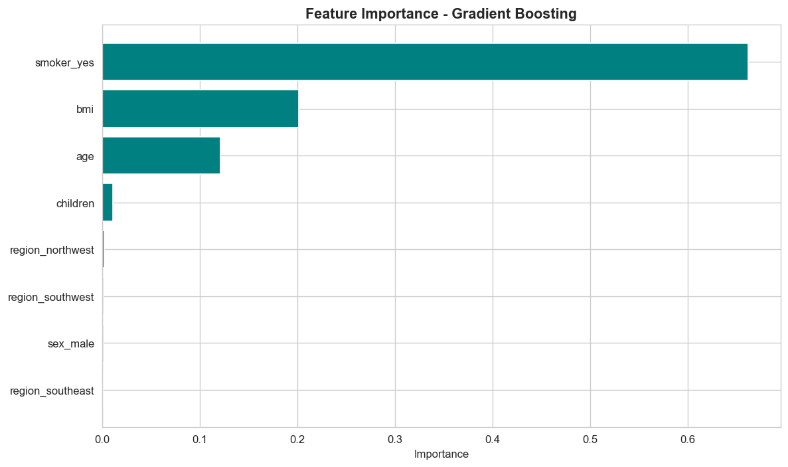

# Insurance Cost Prediction

**Machine Learning Project — Applied AI Bootcamp**

A regression model that predicts annual medical insurance charges based on demographic and health factors.

---

## ML Problem Framing

### 1. State the Goal

**Current / non-ML solution:**
Insurance companies currently use actuarial tables and manual rules created by insurance experts. For example: "multiply age by coefficient + add 50% if smoker". This approach is slow, requires constant review, and cannot capture complex interactions between factors.

**Application, Goal, Description:**
- **Application:** An internal tool for medical insurance sales staff to provide instant pricing for new customers
- **Goal:** Predict annual insurance charges with high accuracy (R-squared above 0.85) from 6 simple customer attributes
- **Description:** Staff inputs customer data (age, sex, BMI, children, smoker status, region) and the model returns the suggested premium in dollars

**ML Task:** Regression — predicting a continuous numerical value (charges in USD)

### 2. Clear Use Case for ML

| Factor | Manual Solution | ML Solution |
|---|---|---|
| **Difference** | Fixed tables and rules | Learns complex relationships (e.g., smoker x BMI interaction) |
| **Cost** | High: experts and time | Low after training: predictions in milliseconds |
| **Maintenance** | Manual table updates yearly | Periodic retraining on new data |
| **Expertise** | Requires actuarial expert | Requires ML engineer for training only |

ML is justified here because: (a) sufficient historical data is available, (b) feature relationships are complex and non-linear, (c) required accuracy benefits from ensemble models.

### 3. Does ART Apply to the Data?

ART = Accuracy, Reliability, Timeliness

- **Accuracy:** Data from real insurance records, features are verifiable (age, BMI from direct measurement)
- **Reliability:** Trusted source (Kaggle / UCI repository), 1338 records with no missing values
- **Timeliness:** Data is not real-time. If healthcare costs rise (medical inflation), the model needs retraining

### 4. Quantity and Quality of Data

- **Size:** 1,338 rows by 7 columns
- **Missing values:** 0 (100% clean data)
- **Balance:** 79.5% non-smokers / 20.5% smokers — natural distribution
- **Distribution:** Target variable `charges` is right-skewed — most values between 1,000 and 20,000 with a long tail extending beyond 60,000
- **Outliers:** Smokers with high BMI are naturally extreme points, not errors

### 5. Engineered Features

The original features are sufficient and don't require complex engineering, but we applied:

| Feature | Processing |
|---|---|
| `age` | Kept as numeric |
| `bmi` | Kept as numeric |
| `children` | Kept as numeric |
| `sex` | One-Hot Encoding (drop_first) |
| `smoker` | One-Hot Encoding (drop_first) |
| `region` | One-Hot Encoding (drop_first) |

Future improvement: Could add an interaction feature `smoker x bmi` since EDA revealed obese smokers pay several times more than others.

### 6. Most Predictive Features

From Gradient Boosting feature importance:

| Rank | Feature | Importance |
|---|---|---|
| 1 | **smoker** | 77.3% |
| 2 | bmi | 13.8% |
| 3 | age | 8.4% |
| 4 | children | 0.4% |
| 5 | region | ~0.1% |
| 6 | sex | ~0.02% |

**Interpretation:** Smoking is the dominant factor. BMI and age are secondary but important. Sex and region have negligible impact.



### 7. Prediction and Decision

- **Model output:** A decimal number in USD representing predicted annual charges
- **Decision:** Staff uses the number as a baseline for pricing. They can multiply by a profit margin (e.g., 1.15) to produce the final offer
- **Example:**
  ```
  Input: {age: 35, sex: male, bmi: 28.5, children: 2, smoker: no, region: southeast}
  Output: $11,729.58 -> Company offer: $13,489.02 (with 15% margin)
  ```

### 8. Model Metrics

Three models evaluated on a 20% test set (268 records):

| Model | MAE ($) | RMSE ($) | R-squared |
|---|---|---|---|
| Linear Regression | 3,247.65 | 4,280.36 | 0.871 |
| Random Forest | 2,031.26 | 2,590.71 | 0.953 |
| **Gradient Boosting** | **2,000.37** | **2,521.53** | **0.955** |

**Gradient Boosting** is the winner:
- **MAE around $2,000** means the model is off by about $2,000 on average
- **R-squared of 0.955** means the model explains 95.5% of the variance in charges

### 9. Success / Failure Criteria

**Success criteria (all met):**
- R-squared above 0.85: achieved (0.955)
- MAE below $3,000: achieved ($2,000)
- Prediction in under 1 second: achieved (milliseconds)
- No missing values in production: achieved

**Failure criteria:**
- R-squared below 0.7 means the model didn't learn relationships, need to revise features
- MAE above $5,000 means errors are financially significant, not commercially viable
- Negative predictions: critical error (no negative charges exist)

---

## Repository Contents

```
insurance-charges-regressor/
├── insurance.csv              # Dataset
├── generate_data.py           # Data generation script (if needed)
├── train.py                   # scikit-learn training script
├── train_autogluon.py         # AutoGluon training script (optional)
├── Insurance_Project.ipynb    # Complete Jupyter notebook
├── app.py                     # FastAPI deployment
├── insurance_model.pkl        # Saved model
├── eda_plots.png              # EDA visualizations
├── feature_importance.png     # Feature importance plot
├── predictions.png            # Predicted vs Actual plot
├── requirements.txt           # Required libraries
└── README.md                  # This file
```

---

## Setup and Usage

### 1. Install Dependencies

```bash
pip install -r requirements.txt
```

### 2. Train the Model

**Option A: scikit-learn (fast, included)**
```bash
python train.py
```

**Option B: AutoGluon (recommended, better results)**
```bash
pip install autogluon.tabular
python train_autogluon.py
```

### 3. Use the Model in Python

```python
import joblib
import pandas as pd

model = joblib.load('insurance_model.pkl')

person = pd.DataFrame([{
    'age': 35, 'sex': 'male', 'bmi': 28.5,
    'children': 2, 'smoker': 'no', 'region': 'southeast'
}])

prediction = model.predict(person)[0]
print(f"Predicted charges: ${prediction:,.2f}")
```

### 4. Run the API (Deployment)

```bash
uvicorn app:app --reload
```

Then open `http://127.0.0.1:8000/docs` to test the API.

**Example curl request:**
```bash
curl -X POST http://127.0.0.1:8000/predict \
  -H "Content-Type: application/json" \
  -d '{"age": 35, "sex": "male", "bmi": 28.5, "children": 2, "smoker": "no", "region": "southeast"}'
```

**Response:**
```json
{
  "predicted_charges_usd": 11729.58,
  "input": {...}
}
```

---

## Summary

- Gradient Boosting model with R-squared of 0.955 and MAE of $2,000
- Smoking is the most important factor (77% of predictive power)
- Model deployed via FastAPI for production use
- Future improvements: add interaction features or use AutoGluon

---

**Bootcamp:** Applied AI Bootcamp — Week 3 ML Project
